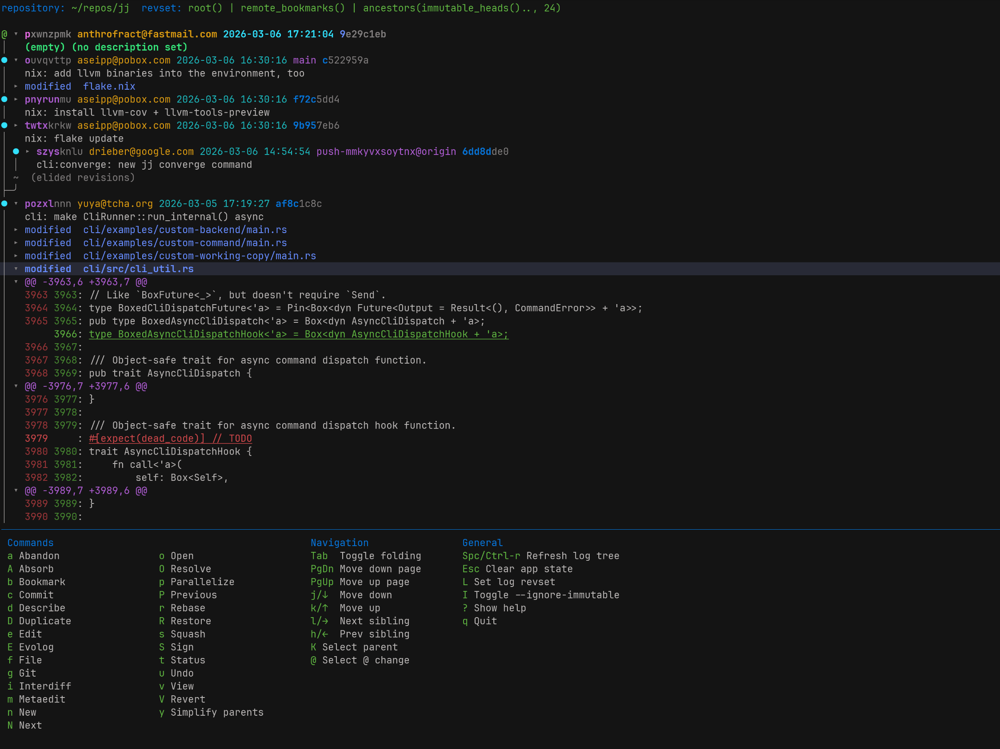

# jjdag



A Rust TUI to manipulate the [Jujutsu](https://github.com/jj-vcs/jj) DAG.

Inspired by the great UX of [Magit](https://magit.vc/).

Very much a work in progress, consider this a pre-alpha release. But I already use it personally for almost all jj operations.

Once you run the program you can press `?` to show the help info. Most of the commands you can see by running `jj help` in the terminal are implemented.

## Features

- Browse the jj log tree with dynamic folding/unfolding of commits and file diffs.
- Multi-key command sequences with transient-menu style help popups. For example type `gpa` to run `jj git push --all`, or `gpt` to run `jj git push --tracked`, or `ss` to squash the selected revision into its parent.
- Output from jj commands is displayed in the bottom panel.
- Mouse support: left click to select, right click to toggle folding, and scroll wheel to scroll.

## Supported jj commands

- `jj abandon`
- `jj absorb`
- `jj bookmark create`
- `jj bookmark delete`
- `jj bookmark forget`
- `jj bookmark move`
- `jj bookmark rename`
- `jj bookmark set`
- `jj bookmark track`
- `jj bookmark untrack`
- `jj commit`
- `jj describe`
- `jj diff`
- `jj duplicate`
- `jj edit`
- `jj evolog`
- `jj file track`
- `jj file untrack`
- `jj git fetch`
- `jj git push`
- `jj interdiff`
- `jj metaedit`
- `jj new`
- `jj next`
- `jj parallelize`
- `jj prev`
- `jj rebase`
- `jj redo`
- `jj resolve`
- `jj restore`
- `jj revert`
- `jj sign`
- `jj simplify-parents`
- `jj squash`
- `jj status`
- `jj undo`
- `jj unsign`

## Installation

With cargo: 
```sh
cargo install --git https://github.com/anthrofract/jjdag
```

Or run the nix flake:
```sh
nix run github:anthrofract/jjdag
```

Or install with the nix flake:

```nix
inputs.jjdag.url = "github:anthrofract/jjdag";

...

nixpkgs.overlays = [ jjdag.overlays.default ];
environment.systemPackages = [ pkgs.jjdag ];
```
